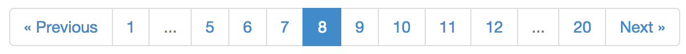

PHP Paginator
=============

A lightweight PHP paginator, for generating pagination controls like Stack Overflow or Flickr.

## Installation

Install with composer: 

    composer require "jasongrimes/paginator: ~0.1"

## Usage

Here's a quick example using the defaults:

    <?php
    
    require '../vendor/autoload.php';

    use JasonGrimes\Paginator;

    $totalItems = 1000;
    $itemsPerPage = 50;
    $currentPage = 8;
    $urlPattern = '/foo/page/(:num)';

    $paginator = new Paginator($totalItems, $itemsPerPage, $currentPage, $urlPattern);
    ?>
    <html>
      <head>
        <!-- The default template supports the Twitter Bootstrap pagination styles. -->
        <link rel="stylesheet" href="//maxcdn.bootstrapcdn.com/bootstrap/3.2.0/css/bootstrap.min.css">
      </head>
      <body>

        <?php 
          // Render with the default, built-in template.
          echo $paginator; 
        ?>

      </body>
    </html>

This will output something like the following:

    <ul class="pagination">
      <li><a href="/foo/page/7">&laquo; Previous</a></li>
      <li><a href="/foo/page/1">1</a></li>
      <li class="disabled">...</li>
      <li><a href="/foo/page/5">5</a></li>
      <li><a href="/foo/page/6">6</a></li>
      <li><a href="/foo/page/7">7</a></li>
      <li class="active"><a href="/foo/page/8">8</a></li>
      <li><a href="/foo/page/9">9</a></li>
      <li><a href="/foo/page/10">10</a></li>
      <li><a href="/foo/page/11">11</a></li>
      <li><a href="/foo/page/12">12</a></li>
      <li class="disabled">...</li>
      <li><a href="/foo/page/20">20</a></li>
      <li><a href="/foo/page/9">Next &raquo;</a></li>
    </ul>

