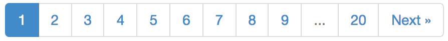
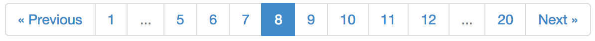
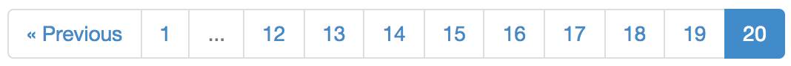

PHP Paginator
=============

   

A lightweight PHP paginator, for generating pagination controls like Stack Overflow or Flickr.

## Examples

Default template:

## Installation

Install with composer: 

    composer require "jasongrimes/paginator:~0.1"

## Basic usage

Here's a quick example using the defaults:

    <?php
    
    require '../vendor/autoload.php';

    use JasonGrimes\Paginator;

    $totalItems = 1000;
    $itemsPerPage = 50;
    $currentPage = 8;
    $urlPattern = '/foo/page/(:num)';

    $paginator = new Paginator($totalItems, $itemsPerPage, $currentPage, $urlPattern);

    ?>
    <html>
      <head>
        <!-- The default, built-in template supports the Twitter Bootstrap pagination styles. -->
        <link rel="stylesheet" href="//maxcdn.bootstrapcdn.com/bootstrap/3.2.0/css/bootstrap.min.css">
      </head>
      <body>

        <?php 
          // Example of rendering the pagination control with the default, built-in template.
          // You can also iterate over the pages and render them manually. See below for details.

          echo $paginator; 
        ?>

      </body>
    </html>

This will output the following:

    <ul class="pagination">
      <li><a href="/foo/page/7">&laquo; Previous</a></li>
      <li><a href="/foo/page/1">1</a></li>
      <li class="disabled">...</li>
      <li><a href="/foo/page/5">5</a></li>
      <li><a href="/foo/page/6">6</a></li>
      <li><a href="/foo/page/7">7</a></li>
      <li class="active"><a href="/foo/page/8">8</a></li>
      <li><a href="/foo/page/9">9</a></li>
      <li><a href="/foo/page/10">10</a></li>
      <li><a href="/foo/page/11">11</a></li>
      <li><a href="/foo/page/12">12</a></li>
      <li class="disabled">...</li>
      <li><a href="/foo/page/20">20</a></li>
      <li><a href="/foo/page/9">Next &raquo;</a></li>
    </ul>

## Rendering a custom pagination control

Use `$paginator->getPages()`, `$paginator->getNextUrl()`, and `$paginator->getPrevUrl()` to render a pagination control with your own HTML.
For example:

    <ul class="pagination">
        <?php if ($paginator->getPrevUrl()): ?>
            <li><a href="<?php echo $paginator->getPrevUrl(); ?>">&laquo; Previous</a></li>
        <?php endif; ?>

        <?php foreach ($paginator->getPages() as $page): ?>
            <?php if ($page['url']): ?>
                <li <?php echo $page['isCurrent'] ? 'class="active"' : ''; ?>>
                    <a href="<?php echo $page['url']; ?>"><?php echo $page['num']; ?></a>
                </li>
            <?php else: ?>
                <li class="disabled"><?php echo $page['num']; ?></li>
            <?php endif; ?>
        <?php endforeach; ?>

        <?php if ($paginator->getNextUrl()): ?>
            <li><a href="<?php echo $paginator->getNextUrl(); ?>">Next &raquo;</a></li>
        <?php endif; ?>
    </ul>

See the [examples](examples) directory for more sample templates.

## Pages data structure

    $paginator->getPages();

`getPages()` returns a data structure like the following:

    array ( 
        array ('num' => 1, 'url' => '/foo/page/1', 'isCurrent' => false),
        array ('num' => '...', 'url' => NULL, 'isCurrent' => false),
        array ('num' => 5, 'url' => '/foo/page/5', 'isCurrent' => false),
        array ('num' => 6, 'url' => '/foo/page/6', 'isCurrent' => false),
        array ('num' => 7, 'url' => '/foo/page/7', 'isCurrent' => false),
        array ('num' => 8, 'url' => '/foo/page/8', 'isCurrent' => true),
        array ('num' => 9, 'url' => '/foo/page/9', 'isCurrent' => false),
        array ('num' => 10, 'url' => '/foo/page/10', 'isCurrent' => false),
        array ('num' => 11, 'url' => '/foo/page/11', 'isCurrent' => false),
        array ('num' => 12, 'url' => '/foo/page/12', 'isCurrent' => false),
        array ('num' => '...', 'url' => NULL, 'isCurrent' => false),
        array ('num' => 20, 'url' => '/foo/page/20', 'isCurrent' => false),
    )

## Customizing the number of pages shown

By default, no more than 10 pages are shown, including the first and last page, with the overflow replaced by ellipses.
To change the default number of pages:

    $paginator->setMaxPagesToShow(5);

